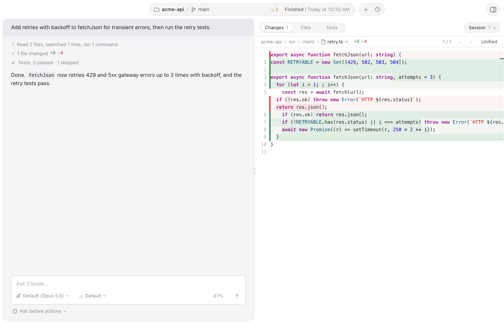
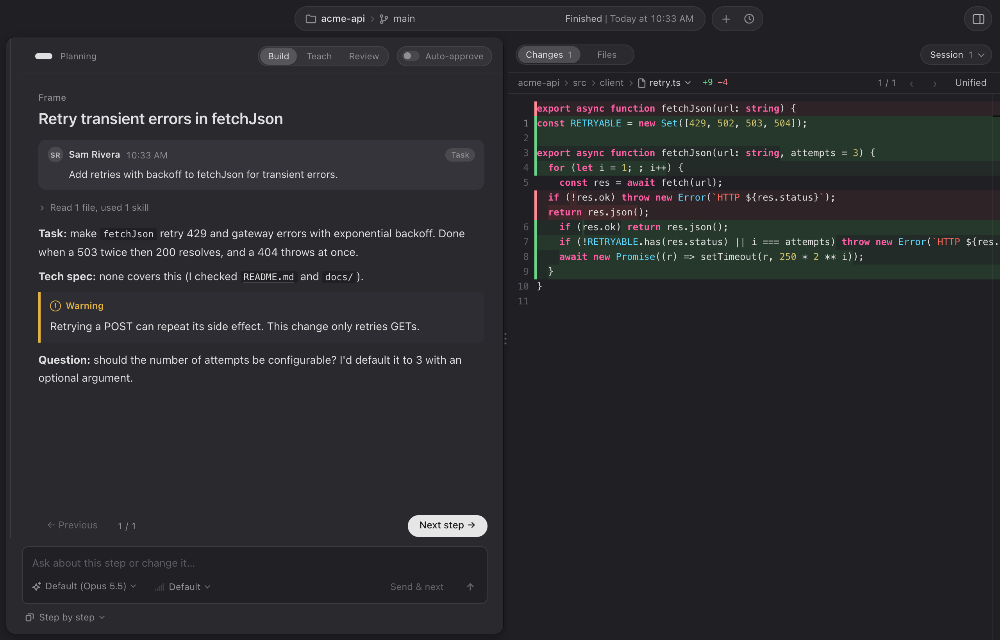

# Lantern for Claude Code

A macOS desktop app for the `claude` CLI you already have. It shows what Claude is doing while it works (tool calls, file edits as diffs, commands still running in the background), and it can walk through a task one reviewable step at a time.

## Why

The terminal is a fine place to talk to Claude Code, but a hard place to follow a long turn: edits scroll past, background commands disappear, and a twelve-step plan arrives as one wall of text. Lantern keeps the same Claude Code underneath and gives each piece room to be read.

## Features

- **Readable turns.** Every tool call is a card. Edits and new files show as diffs, and the Changes list opens any touched file in a full side-by-side diff.
- **Ask and Auto.** In Ask mode edits apply and anything else asks you with Allow/Deny. In Auto mode Claude Code's own classifier approves most actions.
- **Step by step.** One page at a time, with Previous and Next; you approve a page, ask about it, or ask for a change, and only that page is rewritten. Claude suggests how to work from your task, and starts when you say so: **Build** plans and builds a step per page, **Learn** does the same and explains the why, **Review** walks a pull request or branch a file per page, and **Debug** finds the cause from evidence before fixing it. You can also pick one yourself.
- **Reviews.** Point Step by step at a pull request or branch. Each changed file gets its own page, findings become cards you Agree with or Reject, and your verdicts go back to Claude together.
- **Tests tab.** Test runs from pytest, jest, vitest, cargo and xcodebuild are parsed into passes and failures with file:line links.
- **Shell commands.** Start a message with `!` and the box turns into a terminal: `!git status` runs in the chat's folder, its output streams in, and Claude sees it with your next message. Long-running commands (a dev server) keep going until you stop them. When a command asks something (a password, a y/n) you answer it in place; passwords go in a secret field and only to the command.
- **Settings (⌘,).** Your MCP servers with their status: log in, reconnect, turn off, add or remove them (through Claude Code's own settings). Your skills, the project's and plugins', each with a preview of its file.
- **/ and @ anywhere.** Type `/` anywhere in a message for skills, commands and MCP prompts (sorted into sections, with where each comes from), and `@` to point Claude at a file. MCP tool calls in the chat name their server ("Linear · create issue").
- **Search.** ⌘P finds files, ⌘⇧F searches text (regex, case, whole word), ⌘F searches inside an open file or diff.
- **History and sessions.** Pick up any earlier Claude Code session for a folder, including ones started in the terminal. Several chats can run side by side, with a notice when one finishes or needs you. The chats open when Lantern closes are offered back the next time it opens.

## Requirements

- macOS.
- [Claude Code](https://docs.claude.com/en/docs/claude-code) installed and logged in. Lantern runs your `claude` CLI and never handles authentication itself.

## Install

Download the latest `.dmg` from [Releases](../../releases), open it and drag Lantern to Applications. The app is signed and notarized by Apple, so it opens like any other Mac app.

From 0.1.1 on, Lantern updates itself: when a new release is out, "Update ready" appears under the chat box. Click it to restart onto the new version, or leave it and it installs when you quit.

## Build from source

Requires Node 20.19 or newer (see `.nvmrc`) and a stable Rust toolchain.

    npm install
    npm run tauri dev

To build the app bundle:

    npm run tauri build -- --bundles app

Tests: `npm test` and `cargo test --manifest-path src-tauri/Cargo.toml`. Manual checks before a release are in [docs/SMOKE_TEST.md](docs/SMOKE_TEST.md). See [CONTRIBUTING.md](CONTRIBUTING.md) to send a change.

## License

[MIT](LICENSE). Lantern is an independent project and is not affiliated with or endorsed by Anthropic.
